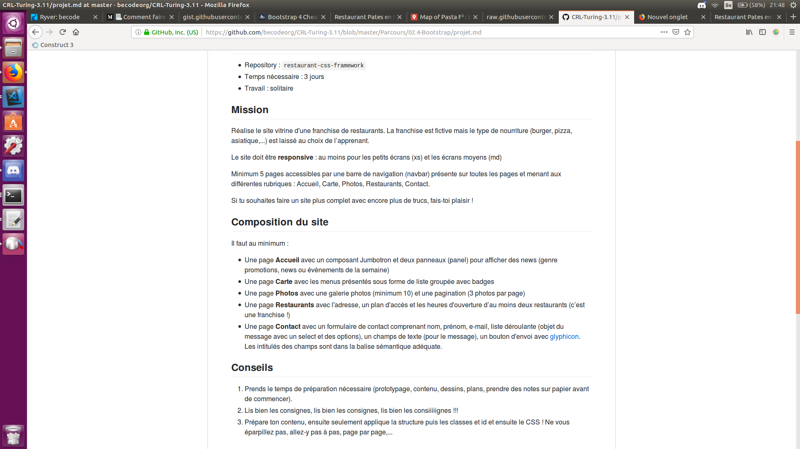

# Implementation of a restaurant website with Bootstrap 4

# Links for the projects

> https://github.com/ParmentierS/restaurantusingbootstrap

> https://parmentiers.github.io/restaurantusingbootstrap/home.html

# Presentation of the project

For this becode project I had to come up with a website for an imaginary restaurant franchise with 5 pages. 
This project was designed for us to learn using Bootstrap 4 when doing it.

I choose to base my website upon an existing restaurant of a friend of mine.
So I didn't have to lose time to come up with the content.
I just had to come up with the structure.

I added a little bit of fantasy here and there since it was for an imaginary franchise.

The website is entirely in French for now since the directives were given in French.

#Date of the Project

From 14th of May 2019 to 20th of May 2019

#Objectives 

- Mastering Bootstrap 4 in a concrete situation
- Planning the structure of each page on paper before writing the HTML/CSS
- Follow precise directives

#Directives

I had to follow these directives when creating the pages :
 

#Short technical description of the 5 pages

> https://parmentiers.github.io/restaurantusingbootstrap/home.html
I used a carrousel engine inside a jumbotron container to make an image slider on the head of the page.
After that I did 3 panels to present the franchise and some news concerning the restaurant.

> https://parmentiers.github.io/restaurantusingbootstrap/menu.html
I used a group list with badges for the prices to do the menu.

> https://parmentiers.github.io/restaurantusingbootstrap/gallery.html#page1
I had to use ids/anchors and the display property to make the pagination of the gallery on one page.

> https://parmentiers.github.io/restaurantusingbootstrap/contactform.html
I used bootstrap syntax to make a form to send a message.
There is a dropdown menu with options.
The form doesn't work since php is not used yet.
There is a font-awesome glyphicon on the send button.

> https://parmentiers.github.io/restaurantusingbootstrap/restaurants.html
There are contact informations for the 3 restaurants of the franchise.
Each restaurant has a google map location displayed on a iframe.
The page is responsive since the iframe is switched  with another every time we resize the window of 100 pixels. 

#Difficulties encountered during the project

1. Firstly I included three bootstrap javascript files twice. 
It caused javascript to not work at all on every page.

2. Secondly iframes of Google Maps were keeping their original size when I was resizing the window.
Trying to change the size in css didn't work for unknown reasons

3. Displaying the gallery on only one page.
I had to use anchors and :target selector to resolve that problem.
The result is not pretty but it works.

4. Difficulties in making bootstrap do exactly what I want 
I had to use an external css file in these situations.

#Bugs to fix in the future

1. The page restaurants.html takes too much time to load.
It's especially annoying on mobile phones.
Possible causes : 
- Google Maps website slow loading 
- Bootstrap css taking too much space.
- Many iframe blocks undisplayed on one page.

2. Find a graphical designer to give me tips to stop making poor choices resulting in an especially ugly design.

3. Find a way to resize iframe without switching between a lot of iframe blocks every 100 pixels.

4. Fix the alignment of options in the navigation menu on small screens.

5. Improve the way images are displayed on the gallery

#Possible Upgrade

- To use a better and more general mixin to automate the process of creating media queries based on specific screen sizes
- To use PHP and a database to receive the form on the contact page.
- More comments in scss and html files
- To have a better structure in the scss file (delete unused variables and mixins)
- Translate that README in French

#Copyright 

Sébastien Parmentier for the structure
Pasta follies, Louvain-la-Neuve for the content

